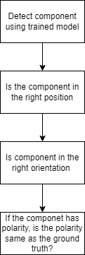

# Optysys

This repo has 3 parts to it:
  - Interface of motors and cameras with PS5
  - GUI
  - Algorithm for training
  
I recommend running the python files in the folder it is placed in. A lot of places have relative path references. 


### Interface with PS5
Motor and camera are interfaced with the PS5. 
Everything is within the filder PS5 interface.

Run using
```
python main_interface.py
```

For individual camera interface with joystick, motor interface with joystick, use scripting begining with 'camera_ ' and 'motor_ ' repsectively. 


The utils folder contains the main functions required to control the motor and Camera. Care must be taken that the correct Serial Port is set manually in these files so that the above python file runs. 


The prep_code folder contains the intial codes for each interface. You can check the joystick buttons numbering using *joystick_interface.py*. The motor interface debugging code can also be found in the same folder. 


### GUI 
The folder name is gui_understanding. 
Use _final_gui_v2.py_ for viewing with one camera (Webcam) and _final_gui_v3.py_ for 2 camera display (Webcam and OpenCV camera). 

The prep_code folder within this folder contains intermediate codes to acheive the UI in decided format(refer PPT). 


### Algorithm
The Algorithm contains the model we could possibly use for the setup. 
More infomation on the dataset can be found in Algorithm/PCB-Component-1495/data.yaml. 

It contains ~4k classes. The dataset is independent of the text written but it still reads these labels. 

A few important comments on the approach in mind: 
- The aim of using this dataset was to identify components because then we can directly compare location + type of component and segregate the error. Consider the following flow chart. If the answer to any of the above question is "No" then there is a mistake in the PCB. 
  

-  FRCNN is prefered over Yolo for the accuracy.Most likely, Yolo should also be able to give close results. Yolo is lighter and would be preferable in the long run 
-  The location matching need not be a pixel-wise match but rather an IoU match. A thresholding can be setup. This helps with 2 things. 
   -  locating close components 
   -  Orientation of the component. A difference in the orientation can be easily found with this. 
-  An overview on how IoU can be used and how close they have to be can be seen in *image_analysis.ipynb*
- 

#### Ultra analytics
For code using ultra analytics, directly use the scipt in *ultraanalytics_version*. 

#### Pytorch
Training
Run 
```
python train.py
```
or incase of linux system 

```
bash run.sh
```

The inference.py code may have some inconsistencies. 

Also check if CUDA is running on the Jetson. 

